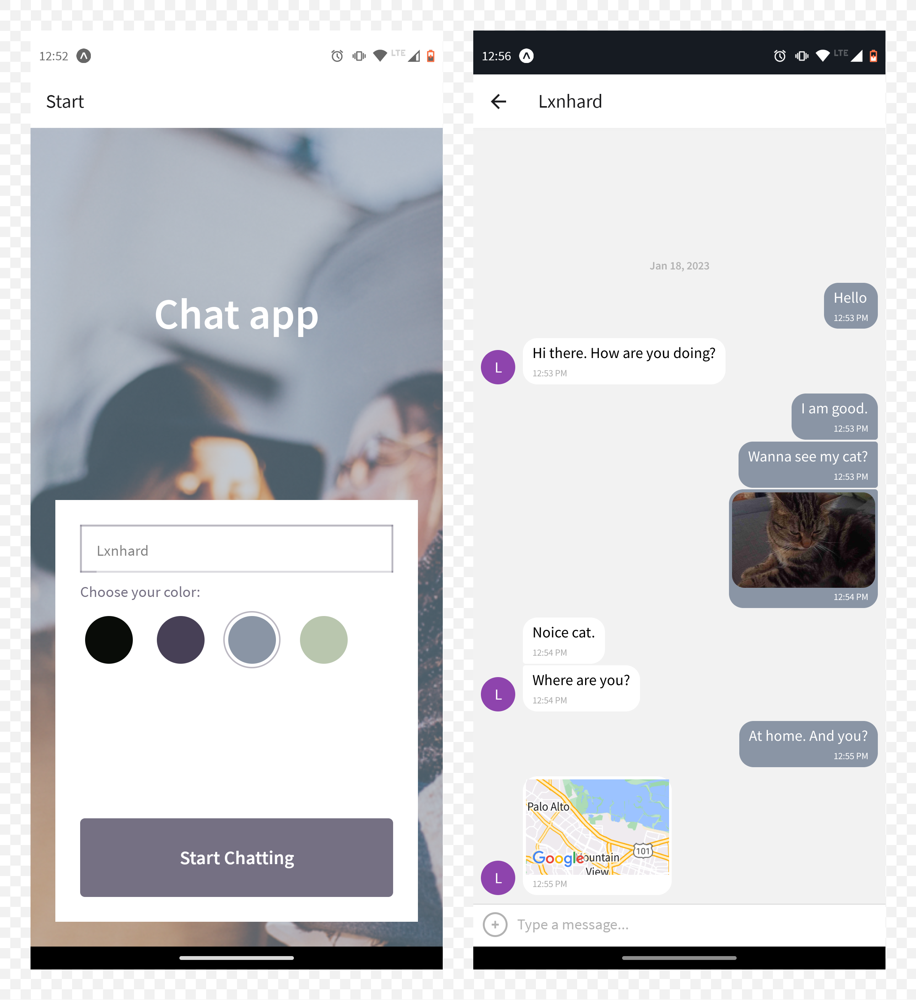

# Chat App
A chat app for mobile devices using React Native. The app provides users with a chat interface and options to share images and their location. The app is based on React Native, Expo, and Google Firestore Database. 

 

## Key Features
- A page where users can enter their name and choose a background color for the chat screen before joining the chat.
- A page displaying the conversation, as well as an input field and submit button.
- The chat provides users with two additional communication features: sending images and location data.
- Data gets stored online and offline.
- Anonymous authentication via Google Firebase.

## Built with

- React Native
- React Native asyncStorage API
- Expo
- Google Firebase
- Gifted Chat

### What I learned

- Principles for programming an android app with React Native and Expo
- Mobile UI design principles
- Using Google Firestore as data storage for real-time applications
- Client-side storage with React Native’s asyncStorage API
- Using device communication features (camera, location)
- Storing media files in Google Cloud Storage